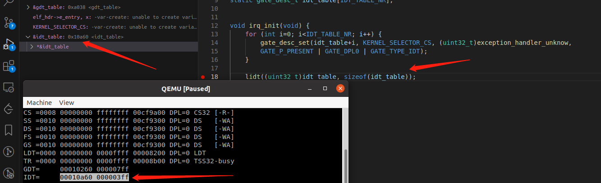
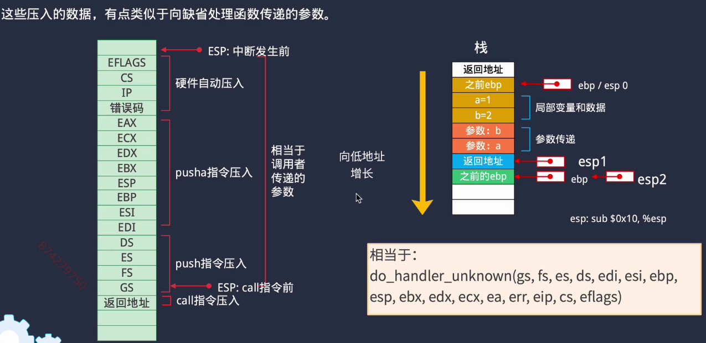

# 框架 #


# 调试过程 #

通过指令`qemu` ` view` `compatmonitor0` : `info registers` 查看进入保护模式后各个**段选择子**的状态，以及**GDT**


`info mem` 查看内存地址的映射


线性地址0x80000000 


任务切换时的tss结构


两任务切换


# 问题解决记录 #

1 debug时配置的类型cppdbg不受支持，重启vscodec/c++扩展

2 VSCode调试debug变量variables窗口空白不显示


3 反汇编查看内核运行指令

# Q&A #

## 0 保护模式是怎么进入的 ##

mov $1, %eax    lmsw %ax      # 设置CR0  P/E 位, 开启保护模式。在这之前要把，两个最重要的寄存器设置好

```cpp
    cli                # 关中断
    lgdt (gdt_desc)    # 设置lgdt寄存器
    lidt (idt_desc)    # 设置igdt寄存器
    mov $1, %eax
    lmsw %ax          # 设置CR0 P/E 位, 开启保护模式
```

x86 架构的汇编语言有两种主要的语法风格：Intel 语法和 AT&T 语法。Intel 语法是最常见的，也是大多数汇编语言教程和文档中使用的风格。

Intel 语法的特点是：

- 指令和操作数的顺序与英文语句的自然顺序相似，即动词（指令）在前，名词（操作数）在后。
- 寄存器和立即数直接写出名称或值，不需要特殊符号。
- 内存地址使用方括号 `[]` 包围。

例如，在 Intel 语法中，将值 `5` 加到寄存器 `eax` 中的指令写作：

```
add eax, 5
```

相对地，AT&T 语法（常用于 Unix-like 系统，如 Linux 上的 GAS 汇编器）的特点是：

- 指令在操作数之后，操作数在前，指令在后。
- 寄存器前加 `%` 符号，立即数前加 `$` 符号。
- 内存地址使用圆括号 `()` 包围。

在 AT&T 语法中，同样的指令写作：

```
addl $5, %eax
```

根据您提供的代码片段，它使用的是 Intel 语法，因为它遵循 Intel 语法的规则。例如，`pusha`、`popa` 和 `iret` 都是指令在前，操作数（如果有的话）在后的格式。

## 0.1 内核初始化做了什么 ##

1 初始化8259中断控制器，打开定时器中断 

2 设置定时器，每100ms中断一次 | 添加中断，设置第0x20号中断 **idt表**

3 添加任务和系统调用 **gdt表**

4 设置页表

5 ltr：将任务0的TSS段选择符加载到任务寄存器tr，只明确加这一次

## 0.2 页表相关的操作有什么寄存器 ##

打开分页机制,设置页表项  cr0(开启分页) cr3(设置页表) cr4(支持4MB直接映射)寄存器

## 1 8259定时器的调度是怎么实现的？ ##

通过cli,sti关开中断，idt表中中断处理函数的0x20被设定为中断处理函数

http://www.xjbcode.fun/Notes/001-modern-computing/008-80286-interrupt-gate.html 

非屏蔽中断的向量和异常的向量是固定的，而屏蔽中断的向量可以通过对中断控制器的编程来改变。但通常大家都遵循一个惯例。比如Linux 对256 个向量的分配如下。 • 从0~31 的向量对应于**异常**和**非屏蔽中断**。 • 从32~47 的向量（即由I/O 设备引起的中断，共16个，对应两个8259A级联所通产生的最大中断个数）分配给可屏蔽中断。32——47也即**0x20~0x2F**。

## 2 任务的调度怎么实现的 ##

在定时处理函数timer_int中，每次都会执行task_sched函数(在内核态中)，任务切换**策略为交替执行**，ljmp 到任务的tss段

```cpp
/*
	task_sched()将切换任务
 */
// 跳转到一个任务的TSS段选择符组成的地址处会造成CPU进行任务切换操作。
// 其中临时数据结构addr用于组建远跳转(far jump)ljmp指令的操作数。该操作数由4字节偏移
// 地址和2字节的段选择符组成。因此tmp中0的值是32位偏移值，而低2字节是新TSS段的
// 选择符task_tss（高2字节不用）。跳转到TSS段选择符会造成任务切换到该TSS对应的进程。对于造成任务
// 切换的长跳转
// 其格式为：jmp 16位段选择符:32位偏移值。但在内存中操作数的表示顺序与这里正好相反。       
void task_sched (void) {
    static int task_tss = TASK0_TSS_SEG;

    // 更换当前任务的tss，然后切换过去
    task_tss = (task_tss == TASK0_TSS_SEG) ? TASK1_TSS_SEG : TASK0_TSS_SEG;
    uint32_t addr[] = {0, task_tss };
    __asm__ __volatile__("ljmpl *(%[a])"::[a]"r"(addr));
}
```

## 3 完整的一次系统调用 ##

1 用户态发起系统调用

```cpp
void sys_show(char* str, char color)
{
    const unsigned long sys_gate_addr[] = {0, SYS_CALL_SEG};  // 使用特权级0
    __asm__ __volatile__("push %[color];    push %[str];      push %[id];       lcalll *(%[gate])\n\n "
            ::[color]"m"(color), [str]"m"(str), [id]"r"(2), [gate]"r"(sys_gate_addr));
}
```

2 调用系统调用表先前已经注册好的系统调用处理函数

```cpp
gdt_table[SYS_CALL_SEG/ 8].limit_l = (uint16_t)(uint32_t)syscall_handler;
```

3 保护现场，把参数依次压入栈中，**call**调用真正的do_syscall

```assembly
syscall_handler:
    push %ds
	pusha						# 保护现场，段寄存器不用保存
	mov $KERNEL_DATA_SEG, %ax
	mov %ax, %ds				#  Push AX, CX, DX, BX, original SP, BP, SI, and DI.

    mov %esp, %ebp				# 下面压栈时,esp会不断变化,所以使用ebp作为基址
	push 13*4(%ebp)				# 提取出原压入的各项参数,再按相同的顺序压入一遍
	push 12*4(%ebp)
	push 11*4(%ebp)
	call do_syscall				# 调用api函数,注意这时是在特级0的模式下运行,可以做很多有需要高权限才能做的事
    add $(3*4), %esp			# 取消刚才压入的值
	popa						# 恢复现场
	pop %ds
	retf $(3*4)					# 使用远跳转
```
## 4 iret和retf的区别 ##
iret和retf都是汇编语言中的跳转指令，用于从子程序返回到调用它的位置。它们的主要区别在于它们所处理的中断类型不同。 

iret指令用于从中断服务例程返回，它会从堆栈中弹出标志寄存器（flags）、代码段选择子（cs）和指令指针（ip），然后继续执行主程序。 大多是时钟中断等

retf指令用于从远程过程调用（RPC）或任务切换返回，它会从堆栈中弹出标志寄存器（flags）、代码段选择子（cs）、指令指针（ip）和堆栈选择子（ss），然后继续执行主程序。 用户态调用内核态函数嘞，用户的栈ss
要保存着

总的来说，iret用于从中断返回，而retf用于从远程过程调用或任务切换返回。

## 5 gdb attach ##

在GDB中，"attach" 是一种将调试器连接到正在运行的进程的操作。这允许你在进程运行时进行调试，包括设置断点、检查变量值、观察堆栈等。"attach" 操作的原理涉及以下几个步骤：

1. **进程附加：** 当你使用GDB的 "attach" 命令时，GDB会尝试连接到指定的进程，它会向目标进程发送一些控制信息以建立连接。
2. **注入调试代码：** 在成功连接到进程后，GDB会在目标进程的内存空间中注入一些调试代码，这些代码将用于与调试器通信，收集信息以及实现调试功能。
3. **设置断点：** 一旦连接建立，你可以在目标进程中设置断点。GDB会在你指定的断点位置插入调试代码，当程序执行到这些位置时，会触发一个中断信号。
4. **中断信号和处理：** 当目标进程达到断点位置时，注入的调试代码将触发一个中断信号，即"中断"。这个信号会暂停目标进程的执行，并将控制权交给GDB调试器。
5. **与调试器交互：** 一旦目标进程被中断，GDB调试器会接管执行控制。你可以使用GDB的命令来检查变量、观察堆栈、单步执行等。你还可以修改变量值，修改寄存器值，然后使用GDB的命令来继续执行程序。

总之，"attach" 操作允许GDB连接到正在运行的进程，通过注入调试代码和中断信号，以便在运行时进行调试。这对于调试已经在运行的进程、在嵌入式系统中调试或者远程调试等场景非常有用。

## 6 boot到loader是怎么跳转的 ##

直接通过内存地址强转的硬跳转

```cpp
#define LOADER_START_ADDR 0X8000

/**
 * Boot的C入口函数
 * 只完成一项功能，即从磁盘找到loader文件然后加载到内容中，并跳转过去
 */
void boot_entry(void) {
    ( (void(*)(void)) LOADER_START_ADDR )();    //强转地址为函数指针做跳转
} 
```

## 7 操作系统多大 ##

int15 读取内存 大约在128M


## 8 load到kernel是怎么跳转的 ##

直接通过内存地址强转的硬跳转


可以看大此时就是调用地址0x1000000出的函数，正是kernel写入到的对应的地址


在接下来看就是内核相关的跳转，从反汇编或者gdb可以看到，跳转位置的地址0xe8 


这个和编译生成的反汇编文件是一致的


可以正确跳转到kernel_init处


## 9 * 调用栈esp/ebp怎么走，参数怎么压栈 ##


对于 `push` 操作，其基本行为如下：**先减在写**

1. 栈指针寄存器（`ESP` 在32位模式下，`RSP` 在64位模式下）的值会先减去被压入数据的大小（例如，如果是一个32位的值，`ESP` 会减去4）。
2. 然后，被压入的数据会被写入到 `ESP` 指向的新地址处。


在x86架构的汇编语言中，当发起函数调用时，压栈的顺序通常遵循以下规则：

1. **参数**：根据调用约定，函数的参数首先被压入栈中。参数的压栈顺序取决于编程语言和操作系统的调用约定。在许多常见的调用约定中，参数从右到左依次压入栈中。(**橙**色)。
2. **返回地址**：在所有参数都被压入栈之后，调用者将返回地址压入栈中。(**蓝**色)。这个返回地址是调用者在函数调用结束后应该继续执行的下一条指令的地址。
3. **基指针（EBP）**：在某些编程语言和操作系统的调用约定中，调用者可能还会将当前的EBP（基指针）寄存器的值压入栈中(**绿**色)。这样做是为了在函数执行期间能够保存和恢复调用者的栈帧状态。
4. **栈指针（ESP）**：在EBP被压入栈之后，调用者通常会将ESP的当前值赋给EBP，以创建新的栈帧。此时，EBP指向了当前栈帧的底部，而ESP指向了当前栈帧的顶部。

此时ebp往上就是传入的参数，往下就是栈上分配的局部变量等。


栈帧的创建和销毁

### 栈帧的创建 ###

1. **调用函数**：当程序调用一个函数时，它会将控制转移到这个函数的代码段。
2. **压入EBP**：在函数的开始处，通常会执行`push ebp`指令，将当前的基指针（EBP）值压入栈中。这一步骤保存了调用者的EBP值，以便稍后可以恢复调用者的栈帧。
3. **设置新的EBP**：紧接着，执行`mov ebp, esp`指令，将当前栈指针（ESP）的值赋给EBP。此时，EBP指向了当前栈帧的底部，为局部变量的分配和参数的访问提供了基地址。
4. **分配空间**：通过`sub esp, <size>`指令，从栈指针中减去一定数量的字节，为局部变量和临时数据分配空间。
5. **参数和局部变量访问**：在函数体内部，可以通过EBP加上偏移量来访问参数和局部变量。
6. **函数返回地址的保存**：当函数被调用时，返回地址（即函数调用后的下一条指令的地址）由调用者自动压入栈中。这个返回地址在EBP栈帧的顶部，可以由EBP加上特定偏移量来访问。

### 函数的执行 ###

在函数体内部，可以执行任何需要的操作，包括：

- 计算和逻辑操作
- 调用其他函数
- 使用局部变量
- 访问参数

### 栈帧的销毁 ###

1. **清理局部变量**：在函数结束之前，通常不需要显式清理为局部变量分配的栈空间，因为栈是后进先出的，当栈帧销毁时，这些空间自然就会被释放。
2. **恢复EBP**：在函数的最后，执行`pop ebp`指令，从栈中弹出先前保存的EBP值，恢复调用者的EBP。
3. **恢复栈指针**：如果需要，可以通过将EBP的值赋给ESP来恢复调用者的栈指针。但在大多数情况下，这一步不是必须的，因为ESP会自动指向下一个栈帧的底部。
4. **返回调用者**：执行`ret`指令，这个指令会从栈中弹出返回地址并将其放入指令指针（EIP），从而将控制权返回给调用者。
5. **继续执行**：控制权回到调用者，程序继续执行下一条指令。

通过这种方式，每个函数调用都拥有自己独立的栈帧，确保了变量和数据的隔离，同时也保证了程序的可维护性和正确性。


在x86架构中，参数传递通常是通过栈来完成的，遵循特定的调用约定。在CDECL调用约定中，参数是从右到左压入栈中的，而在STDCALL调用约定中，调用者负责在函数返回后清理参数。

当一个函数调用发生时，参数被压入栈中，然后是返回地址，最后（在需要的情况下）是EBP寄存器。这些操作通常由编译器生成的代码自动完成。

**参数传递示例**

假设有两个参数a和b，以及一个返回地址：

```
+---------------------+
|   Argument b       |
+---------------------+
|   Argument a       |
+---------------------+
|   Return Address   |
+---------------------+
|   Old EBP (optional)|
+---------------------+
|   New EBP          |
+---------------------+
```

**函数返回时**

当函数通过`ret`指令返回时，发生以下步骤：

1. **返回地址被弹出**：`ret`指令首先从栈中弹出返回地址，并将这个地址放入EIP寄存器中。这样，CPU就知道函数返回后应该执行哪一条指令。

2. **EBP被弹出（如果之前有压入）**：如果函数开始时压入了EBP（`push ebp`），`ret`指令会弹出这个值到EBP寄存器中，恢复调用者的EBP状态。

3. **ESP被更新**：`ret`指令会将ESP寄存器的值更新为当前EBP的值，这样ESP就指向了先前栈帧的顶部，也就是调用者函数的局部变量和参数的上方。

4. **参数清理（如果是STDCALL）**：在STDCALL调用约定中，如果函数成功返回，调用者需要清理被压入栈中的参数。这通常通过在`ret`指令前添加一个立即数来完成，如果函数遵循 STDCALL 调用约定，调用者负责清理栈上的参数。在这种情况下，`ret` 指令可以被编码为 `ret n`，其中 `n` 是参数大小的字节数。这种形式的 `ret` 指令在将返回地址弹出到 EIP 后，还会将 ESP 向前移动 `n` 字节，从而跳过并清理所有参数。

5. **控制权转移**：此时，程序控制权已经转移回调用者，**EIP指向函数调用后的下一条指令，而ESP指向调用者函数的栈帧顶部**。

在CDECL调用约定中，参数不需要清理，因为它们在函数返回后仍然留在栈上，直到调用者函数返回。

**注意**

- `ret`指令后面跟随的立即数（如果有的话）仅用于STDCALL约定，CDECL约定中通常不使用。
- 在实际的程序中，编译器会根据选择的调用约定来生成相应的代码。

在您提供的代码示例中，如果`kernel_init`函数遵循CDECL调用约定，那么它不需要在返回之前清理`a`和`b`参数。如果遵循STDCALL约定，那么它需要在`ret`指令前适当地调整ESP，以清理这些参数。

## 10 反汇编/链接相关 ##

反汇编的文件中可以清楚地看到源文件中的符号具体是那个段的


## 11 加载bin文件转为加载elf文件 ##

```cpp
# 写kernel区，定位到磁盘第100个块
dd if=kernel.elf of=$DISK1_NAME bs=512 conv=notrunc seek=100
    
# 读磁盘的第100个块，放到内存中的0x100000 16^5 = 2^20 = 1M
read_disk(100, 500, (uint8_t *)SYS_KERNEL_LOAD_ADDR);

# 解析内存中的0x100000的elf文件，按照elf文件的分配(*.lds的设置)，把kernel放到0x10000处
uint32_t kernel_entry = reload_elf_file((uint8_t *)SYS_KERNEL_LOAD_ADDR);

gdb加载内核符号文件的位置也要跟着变化
```


因为elf文件相比bin文件占据的空间要小很多，可以根据elf文件的指示，在load的时候把对应数据段放入内存中的对应位置。

```cpp
COMMAND ${OBJCOPY_TOOL} -S ${PROJECT_NAME}.elf ${CMAKE_SOURCE_DIR}/image/${PROJECT_NAME}.elf
COMMAND ${OBJCOPY_TOOL} -O binary ${PROJECT_NAME}.elf ${CMAKE_SOURCE_DIR}/image/${PROJECT_NAME}.elf
```


gdb查看改地址的16位表示，就是新修改的位置0x10000


## 12 分段、分页 ##


## 13 中断 ##


lidt 加载中断向量表




## 14 异常处理函数 ##



断点可以看到寄存器中的值，通过exception_frame_t传入，eip对应的代码地址0x10288正好就是反汇编代码中的idiv %ecx即发生除0异常的地方


## 14 打印 ##

## 15 任务切换TSS ##

1 far_jump 通过硬件保存任务状态


2 代码保存任务状态

可以为这些状态单独设置空间保存，当然也可以直接将其保存在任务自己的栈中。


有些寄存器需要caller保存，有些需要callee保存


## 16 信号量、互斥锁 ##

信号量的收发


**互斥锁和信号量的实现很类似**

互斥锁的lock和信号量的wait，都是内部各自维护一条队列，把进程从就绪队列中移除，放入各自的等待队列中，等到unlock/notify时在放回当前的就绪队列中等待再次被调度。想比之前的直接关中断方法，这个的临界区是由信号量、锁的不可同时持有保证的，直接关中断相当于不再接受定时器的时钟中断，调度函数也就会不再运行。

## 17 内存管理 ##

https://blog.csdn.net/qq_41565920/article/details/129353386  之前自己整理的linux早期内存管理


进程写数据的时候，实际上会往虚拟内存中写(操作系统对进程的虚拟化)。实际上是在页表项中写数据，然后操作系统映射的页表项对应的物理地址可能是不连续的(操作系统对内存的虚拟化)，但是进程不知道，一直都是往连续的页表项中写。虚拟内存其实并不占据地方，只是抽象出来的页表项是吗。

1. **虚拟内存与页表**：
   - 虚拟内存是一种内存管理技术，使得每个进程可以认为自己有一个连续的、私有的内存地址空间。实际上，这些地址可能映射到物理内存的不同位置，甚至可能映射到磁盘上的交换空间。
   - 页表是一种数据结构，用于将虚拟地址转换为物理地址。每个进程都有一个页表，操作系统通过页表管理和维护这些映射关系。
2. **页表项与物理内存**：
   - 页表项（Page Table Entry, PTE）包含了虚拟页与物理页的映射关系。当进程访问一个虚拟地址时，CPU通过查找页表将其转换为物理地址。
   - 页表项中的物理地址可能是不连续的，即使虚拟地址是连续的。例如，虚拟地址0x0000到0x0FFF可能映射到物理地址0x1000到0x1FFF，而虚拟地址0x1000到0x1FFF可能映射到物理地址0x3000到0x3FFF。
3. **进程的视角**：
   - 从进程的角度来看，它只看到连续的虚拟地址空间，不知道也不需要关心这些虚拟地址实际映射到哪里。操作系统负责管理这些映射关系，使得进程可以专注于其逻辑操作。
4. **虚拟内存占用**：
   - 虚拟内存本身并不占用物理内存，它只是一个抽象概念。实际的物理内存是由页表项映射的物理页来占用的。当一个虚拟页第一次被访问时，如果它还没有对应的物理页，操作系统会分配一个物理页并更新页表项。

总结来说，虚拟内存使得进程能够方便地操作内存，而无需关心底层的物理内存布局。这种抽象极大地简化了内存管理，并提高了系统的灵活性和安全性。


**在平坦模型中，线性地址和逻辑地址是一个东西。**


**一级页表**

缺点是需要的内存太大：4GB/4kb个页表项 * sizeof(页表项)(4bytes) = 4MB


**二级页表**

可以用到的时候再分配二级页表，lazy

页目录4kb+用到的页表 内存大大减少


325384-sdm-vol-3abcd：二级页表，**每个页表项对应4kb**

**介于一级页表和二级页表之间的一种分页解决方案**，**每个页目录项直接对应4MB**


## 18 位图的内存分配 ##


对比debug的结果和反汇编生成的txt文件中的位置一致。


```txt
Section Headers:
  [Nr] Name              Type            Addr     Off    Size   ES Flg Lk Inf Al
  [ 0]                   NULL            00000000 000000 000000 00      0   0  0
  [ 1] .text             PROGBITS        00010000 001000 002908 00  AX  0   0  1
  [ 2] .rodata           PROGBITS        00012908 003908 0004c8 00   A  0   0  4
  [ 3] .data             PROGBITS        00012dd0 003dd0 000004 00  WA  0   0  4
  [ 4] .bss              NOBITS          00012de0 003dd4 004f10 00  WA  0   0 32
  
    00012de0
+    004f10
---------
  00017cf0  
```

这里通过lds中的变量，我们知道了从.text （00010000）开始到.bss结束的内存的位置，在这个位置之后，我们要放置位图了。

```cpp
SECTIONS
{
    . = 0x10000;

	.text : {
		*(.text)
	} 

	.rodata : {
		*(.rodata)
	}

	.data : {
		*(.data)
	}
	.bss : {
		*(.bss)
	}

	PROVIDE(mem_free_start = .);
}
```

## 19 设置二级页表 ##

在修改lds进行4kb对齐之后，设置完毕二级页表执行完写入cr3后，qemu有如下输出，对应设置物理内存的访问权限


## 20 进程有自己的页表 ##

映射自己的线性地址和实际物理地址。不同进程相互隔离。不同进程共享操作系统代码。

每个进程都有自己的页目录表和页表，所以

**不同进程中线性地址可能实际上对应着相同的物理内存(共享)，或者不同的物理内存(隔离)**


## 21 隔离操作系统与进程 ##

因为没有文件系统，所以进程代码和操作系统放在一起。现在进行 123

物理内存放一起，load后运行时分开放


### 21.1 单独指定elf中某些段的运行地址和加载地址 ###

加载地址和运行地址是不一样的。

加载地址是相对于静态存储的概念

运行地址是相对于动态运行的概念


修改前

```assembly
/* 参考文档： https://ftp.gnu.org/old-gnu/Manuals/ld-2.9.1/html_chapter/ld_3.html */
SECTIONS
{
	PROVIDE(kernel_base = 0x0);
    . = 0x10000;

	PROVIDE(s_text = .);
	.text : {
		*(.text)
	} 

	.rodata : {
		*(.rodata)
	}
	PROVIDE(e_text = .);

	. = ALIGN(4096);
	PROVIDE(s_data = .);
	.data : {
		*(.data)
	}

	.bss : {
		*(.bss)
	}
	PROVIDE(mem_free_start = .);
}

# 生成的 elf文件
Program Headers:
  Type           Offset   VirtAddr   PhysAddr   FileSiz MemSiz  Flg Align
  LOAD           0x001000 0x00010000 0x00010000 0x03210 0x03210 R E 0x1000
  LOAD           0x005000 0x00014000 0x00014000 0x00044 0x06de0 RW  0x1000
  GNU_STACK      0x000000 0x00000000 0x00000000 0x00000 0x00000 RWE 0x10

 Section to Segment mapping:
  Segment Sections...
   00     .text .rodata 
   01     .data .bss 
   02     
```

修改后

```assembly
/* 参考文档： https://ftp.gnu.org/old-gnu/Manuals/ld-2.9.1/html_chapter/ld_3.html */
SECTIONS
{
	PROVIDE(kernel_base = 0x0);
    . = 0x10000;

	PROVIDE(s_text = .);
	.text : {
		*(EXCLUDE_FILE(*first_task*) .text)
	} 

	.rodata : {
		*(EXCLUDE_FILE(*first_task*) .rodata)
	}
	PROVIDE(e_text = .);

	. = ALIGN(4096);
	PROVIDE(s_data = .);
	.data : {
		*(EXCLUDE_FILE(*first_task*) .data)
	}

	.bss : {
		*(EXCLUDE_FILE(*first_task*) .bss)
	}
	e_data = .;

	/* 初始进程的配置：接紧着在低端1MB内存开始存储，但是运行时搬运到0x80000000处 */
	. = 0x80000000;
	.first_task : AT(e_data) {
		*first_task_entry*(.text .data. rodata .data)
		*first_task*(.text .data. rodata .data)
	}
	e_first_task = LOADADDR(.first_task) + SIZEOF(.first_task);

	PROVIDE(mem_free_start = e_first_task);
}


Program Headers:
  Type           Offset   VirtAddr   PhysAddr   FileSiz MemSiz  Flg Align
  LOAD           0x001000 0x00010000 0x00010000 0x031d7 0x031d7 R E 0x1000
  LOAD           0x005000 0x00014000 0x00014000 0x00044 0x06de0 RW  0x1000
  LOAD           0x006000 0x80000000 0x0001ade0 0x0003c 0x0003c RWE 0x1000
  GNU_STACK      0x000000 0x00000000 0x00000000 0x00000 0x00000 RWE 0x10

 Section to Segment mapping:
  Segment Sections...
   00     .text .rodata 
   01     .data .bss 
   02     .first_task 
   03   
```

修改之后，dump 0x80000000处的反汇编和first_task_entry一致


## 22 特权级 ##

数据段访问相关的3种与权限相关的配置位：段描述符DPL(Descriptor privilege level(DPL))、选择子RPL(Requested privilege level(RPL))、段寄存器CS中的CPL(Current privilege level)。权限错误将产生段保护异常。

访问数据段(DS,ES,FS,GS)时，仅当DPL>=Max(CPL,RPL)时才能访问。即本身的特权级要够大，且不能以过低的特权级请求去访问。当访问SS时，要求CPL=DPL=RPL。


## 23 创建系统调用  ##

调用们描述符


系统调用时的特权级切换，retf (far return) 回到不同的代码段中，ss/esp特权级1  **retf $(4*5)**，对应的是syscall_frame_t结构体。


手动压栈一部分参数，为了后续的fork子进程。


使用BIOS提供的 int $0x80 发起系统调用而不是自己实现，参见13.06部分

## 24 fork ##


父子进程的用户地址空间分配，涉及到页表的copy

```cpp
    // 遍历用户空间页目录项
    for (int i = user_pde_start; i < PDE_CNT; i++, pde++) {
        if (!pde->present) {
            continue;
        }

        // 遍历页表
        pte_t * pte = (pte_t *)pde_paddr(pde);
        for (int j = 0; j < PTE_CNT; j++, pte++) {
            if (!pte->present) {
                continue;
            }

            // 分配物理内存
            uint32_t page = addr_alloc_page(&paddr_alloc, 1);
            if (page == 0) {
                goto copy_uvm_failed;
            }

            // 建立映射关系
            uint32_t vaddr = (i << 22) | (j << 12);
            int err = memory_create_map((pde_t *)to_page_dir, vaddr, page, 1, get_pte_perm(pte));
            if (err < 0) {
                goto copy_uvm_failed;
            }

            // 复制内容。
            kernel_memcpy((void *)page, (void *)vaddr, MEM_PAGE_SIZE);
        }
    }
```

在这段代码中，`uint32_t vaddr = (i << 22) | (j << 12);` 这一行是根据页目录项（Page Directory Entry, PDE）和页表项（Page Table Entry, PTE）的索引来构建虚拟地址的。这里使用的是二级页表机制，其工作原理如下：

1. **页目录项（PDE）**：在32位系统中，页目录项通常包含一个页表的物理地址。页目录项的索引`i`用于访问特定的页目录项。由于每个页目录项通常对应于4MB的虚拟地址空间（因为`2^10 = 1024`个页表项，每个页表项对应4KB的页面，`1024 * 4KB = 4MB`），所以页目录项的索引需要左移22位（即乘以`2^10`）来得到对应的虚拟地址范围的起始地址。
2. **页表项（PTE）**：页表项包含一个页面的物理地址。页表项的索引`j`用于访问特定的页表项。每个页表项对应于4KB的虚拟地址空间，因此页表项的索引需要左移12位（即乘以`2^12`）来得到对应的虚拟页面在页目录项对应范围内的偏移量。
3. **组合索引**：通过将页目录项索引`i`左移22位和页表项索引`j`左移12位，然后将这两个值进行或操作（`|`），可以得到完整的虚拟地址。这是因为在二级页表中，虚拟地址被分为三个部分：页目录索引、页表索引和页面内偏移量。页面内偏移量通常是低12位，因为每个页面大小为4KB（`2^12`字节）。

具体来说，虚拟地址的计算方式如下：

- `(i << 22)`：将页目录项索引`i`左移22位，得到页目录项对应的4MB虚拟地址范围的起始地址。
- `(j << 12)`：将页表项索引`j`左移12位，得到页表项在页目录项对应的4MB范围内的4KB页面的偏移量。
- `(i << 22) | (j << 12)`：将上述两个值进行或操作，得到完整的虚拟地址。

这种地址计算方式是基于x86架构的分页机制，其中虚拟地址被分为三个部分：高10位用于页目录索引，接下来的10位用于页表索引，低12位用于页面内偏移量。这种分页机制允许32位虚拟地址空间最大可达4GB。


## 25 exec ##

`crt0.S`是C运行时启动代码（C Runtime Start），它的主要任务是初始化程序运行环境，并为C语言程序的执行做好准备。是负责调用main函数的代码。


### 把elf中的内容加载到新的页表中 ###

```cpp
/**
 * @brief 获取指定虚拟地址的物理地址
 * 如果转换失败，返回0。
 */
uint32_t memory_get_paddr (uint32_t page_dir, uint32_t vaddr) {
    pte_t * pte = find_pte((pde_t *)page_dir, vaddr, 0);
    if (pte == (pte_t *)0) {
        return 0;
    }

    return pte_paddr(pte) + (vaddr & (MEM_PAGE_SIZE - 1));
}
```

假设我们使用的是一个简单的分页系统，其中：

- 虚拟地址空间的大小是4GB（2^32字节）。
- 每个页的大小是4KB（2^12字节）。

在这个系统中，虚拟地址被分为三个部分：

1. **页目录索引**：用于在页目录中查找页表的索引。如果我们有1024个页目录项（PDEs），每个项指向一个页表，那么需要10位来表示页目录索引（因为2^10 = 1024）。
2. **页表索引**：用于在页表中查找页表项（PTE）的索引。如果我们有1024个页表项，每个项指向一个页，那么需要10位来表示页表索引（因为2^10 = 1024）。
3. **页内偏移量**：用于在页内查找具体的字节偏移。由于每个页是4KB，我们需要12位来表示页内偏移量（因为2^12 = 4096）。

现在，让我们取一个具体的虚拟地址：0x12345678。

- **页目录索引**：我们取虚拟地址的高10位作为页目录索引。对于0x12345678，高10位是0x0012，所以页目录索引是0x0012。
- **页表索引**：我们取虚拟地址的中间10位作为页表索引。对于0x12345678，中间10位是0x0034，所以页表索引是0x0034。
- **页内偏移量**：我们取虚拟地址的低12位作为页内偏移量。对于0x12345678，低12位是0x5678，所以页内偏移量是0x5678。

所以，虚拟地址0x12345678可以分解为：

- 页目录索引：0x0012
- 页表索引：0x0034
- 页内偏移量：0x5678

在实际的内存管理中，操作系统会使用这些索引来查找页目录项和页表项，然后根据这些项中的信息找到对应的物理页框地址。最后，将物理页框地址与页内偏移量相加，得到最终的物理地址。例如，如果页目录项和页表项指向的物理页框地址是0x00001000，那么最终的物理地址将是0x00001000 + 0x5678 = 0x00006678。

在成功将shell.elf加载到内存中时，切换页表之后，gdb查看当前页表的反汇编和shell.elf一致

```cpp
-exec disassemble 0x81000000 
```


### 压栈argc，**argv ###

argv` 是一个类型为 `char *[] 的数组，其中每个元素都是一个 char *


# OS #


x /20xb 0x8000：访问0x8000后面20个字节(b)，以16(x)进制形式显示


##  ##
